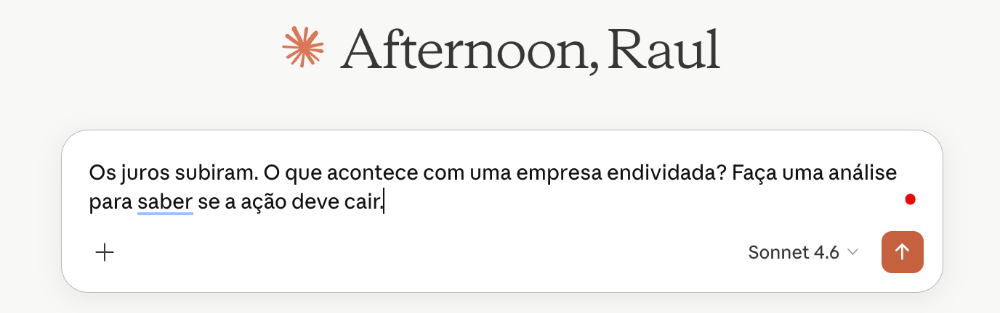
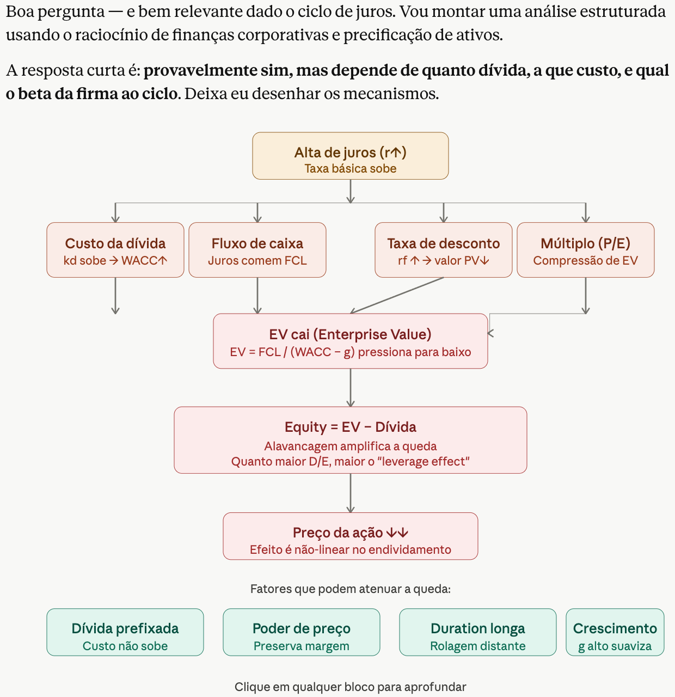
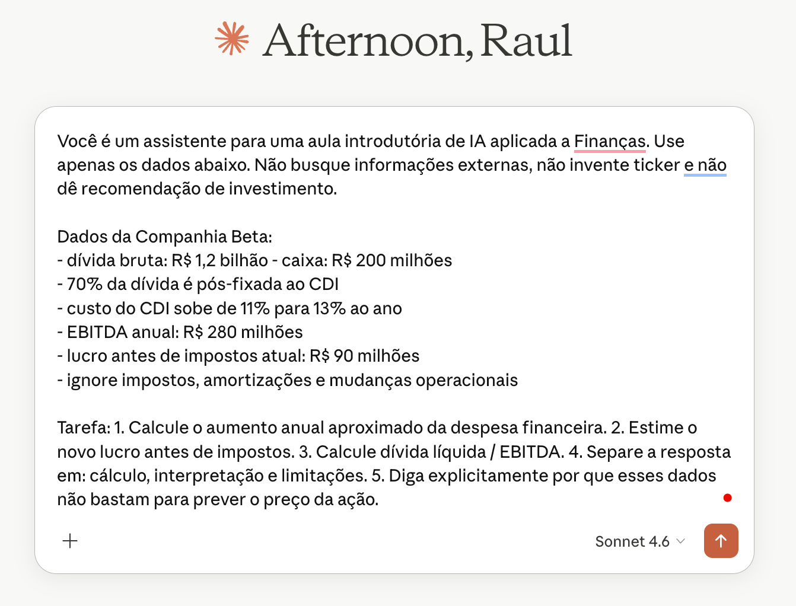
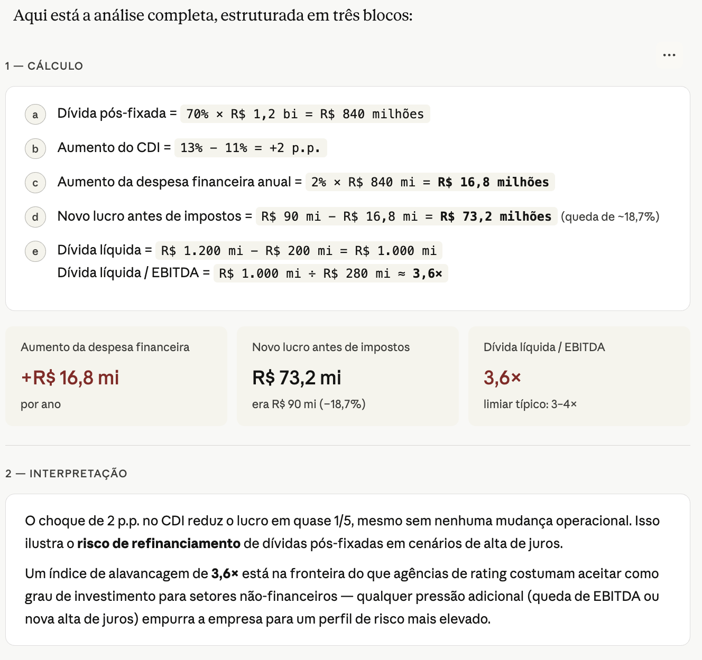
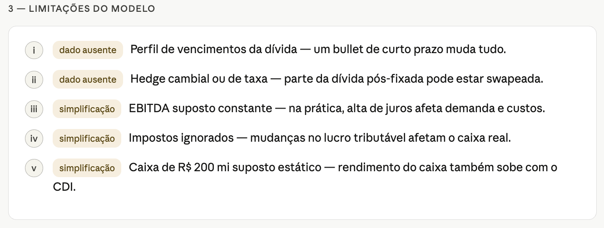
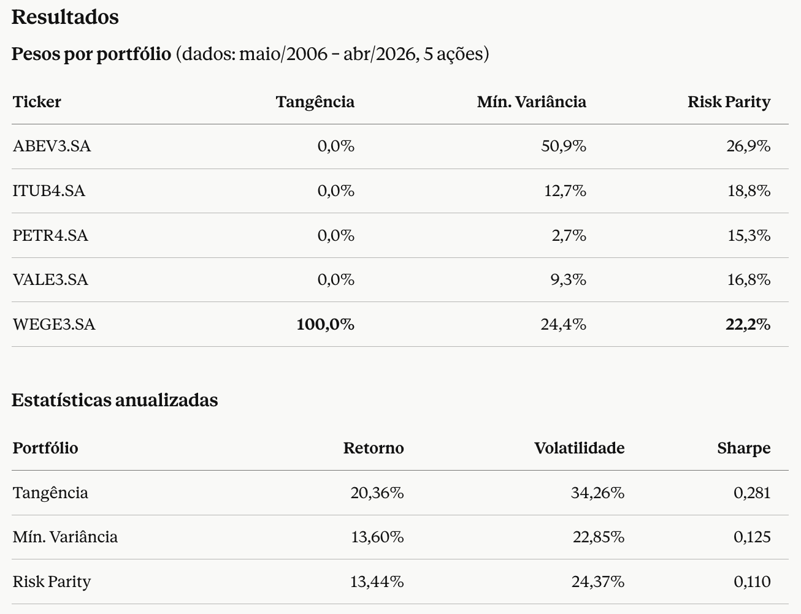
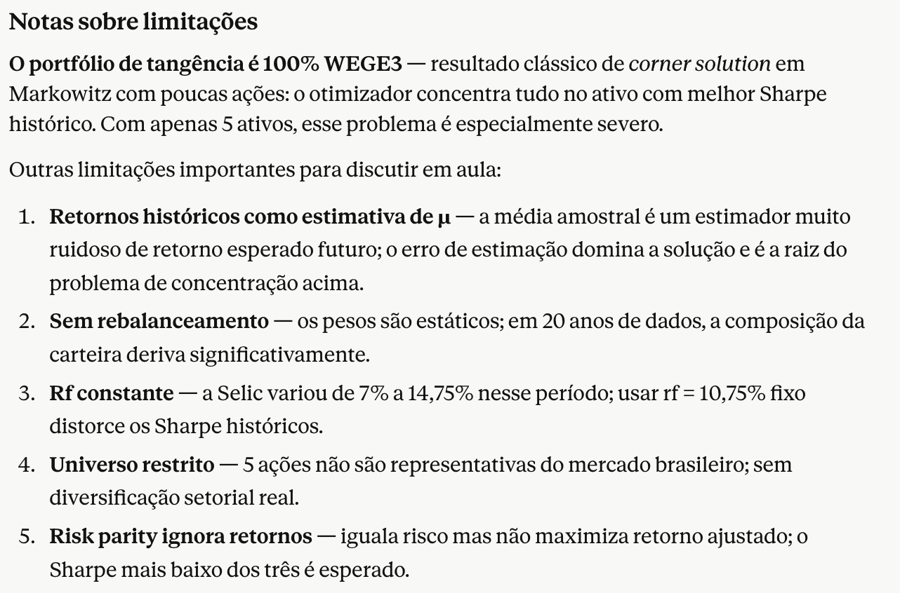
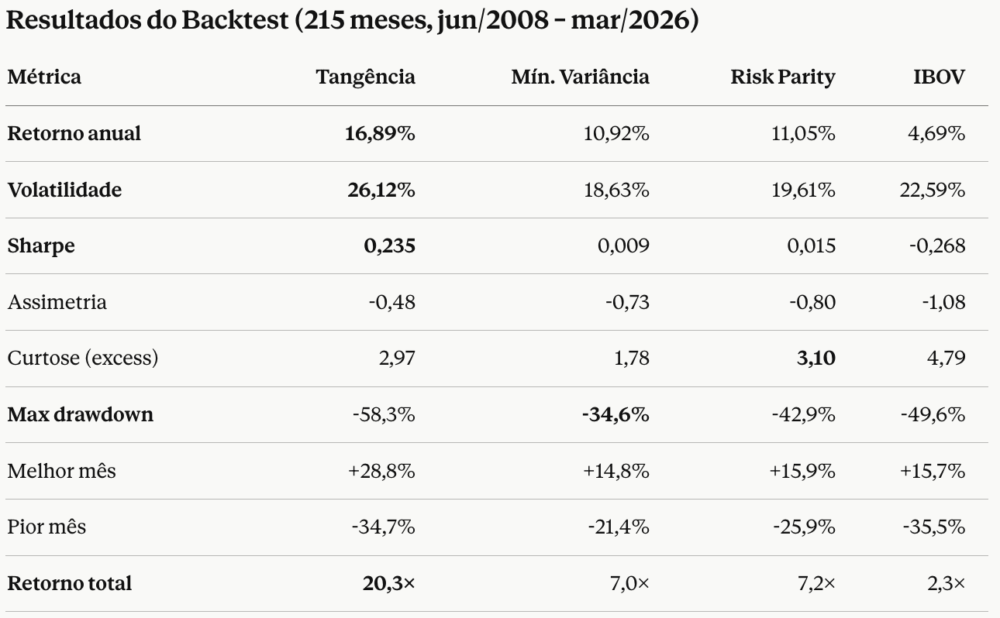
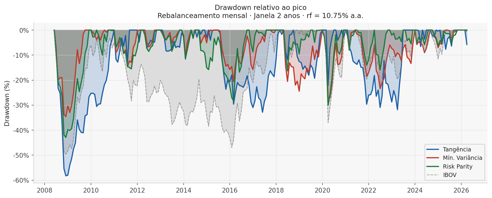
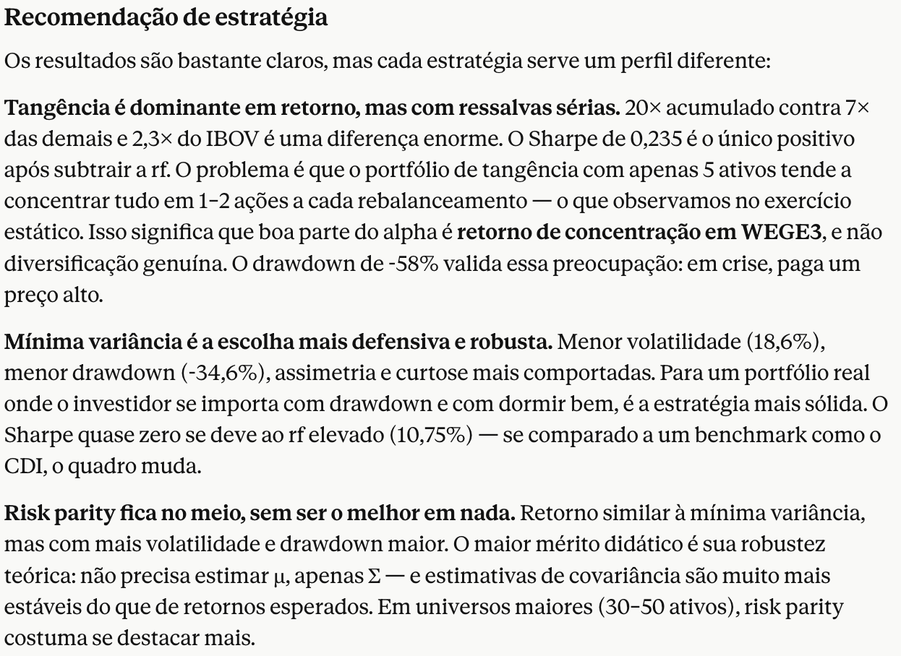

```{python}
#| label: setup
#| include: false

from pathlib import Path
from textwrap import wrap

import pandas as pd
import matplotlib.pyplot as plt

plt.rcParams["font.family"] = "Arial"
plt.rcParams["figure.dpi"] = 140

CORES_FURG = ["#A31229", "#C77824", "#E5AD2A"]
VERMELHO_FURG = CORES_FURG[0]
COR_CONTORNO = "#5F0A18"


def localizar_planilha():
    bases = [Path.cwd(), Path.cwd().parent]

    for base in bases:
        arquivos = sorted(base.glob("*.xlsx"))
        if arquivos:
            return arquivos[0]

    raise FileNotFoundError("Planilha Excel não encontrada na pasta do projeto.")


planilha = localizar_planilha()
df = pd.read_excel(planilha)


def serie_limpa(coluna):
    return (
        df[coluna]
        .fillna("Não informado")
        .astype(str)
        .str.strip()
        .replace({"": "Não informado", "-": "Não informado"})
    )


def normalizar_curso(valor):
    texto = str(valor).strip()
    texto_min = texto.lower()

    if texto_min in {"", "-", "não informado"}:
        return "Não informado"
    if "cont" in texto_min:
        return "Ciências Contábeis"
    if "comput" in texto_min or "sistemas" in texto_min:
        return "Computação e Sistemas"
    if "econ" in texto_min or "economia" in texto_min:
        return "Ciências Econômicas"
    if "admin" in texto_min:
        return "Administração"
    if "modelagem" in texto_min:
        return "Modelagem Computacional"

    return texto


def quebrar_rotulos(rotulos, largura=20):
    return ["\n".join(wrap(str(rotulo), largura)) for rotulo in rotulos]


def plotar_histograma(coluna, ordem=None, normalizador=None):
    dados = serie_limpa(coluna)

    if normalizador is not None:
        dados = dados.map(normalizador)

    contagens = dados.value_counts()

    if ordem is not None:
        contagens = contagens.reindex(ordem).dropna()

    fig, ax = plt.subplots(figsize=(9.5, 3.9))
    barras = ax.bar(
        range(len(contagens)),
        contagens.values,
        color=VERMELHO_FURG,
        edgecolor=COR_CONTORNO,
        linewidth=0.8,
        zorder=3,
    )

    ax.set_ylabel("Participantes", fontsize=14)
    ax.set_xticks(range(len(contagens)))
    ax.set_xticklabels(quebrar_rotulos(contagens.index), fontsize=12)
    ax.tick_params(axis="y", labelsize=12)
    ax.set_axisbelow(True)
    ax.grid(axis="y", alpha=0.25, zorder=0)
    ax.spines["top"].set_visible(False)
    ax.spines["right"].set_visible(False)

    limite_superior = max(contagens.values) + 2
    ax.set_ylim(0, limite_superior)

    for barra in barras:
        altura = barra.get_height()
        ax.text(
            barra.get_x() + barra.get_width() / 2,
            altura + 0.2,
            str(int(altura)),
            ha="center",
            va="bottom",
            fontsize=15,
        )

    plt.tight_layout(pad=0.8)
    plt.show()
```

# Intro

## Quem sou eu

- Graduação e Mestrado em Economia na FGV EPGE
- Doutorado em Finanças na Northwestern University
- Pesquisa em Finanças, Econometria, e métodos de Aprendizado de Máquina
- Contato: [rgriva.github.io](https://rgriva.github.io) | [@rgriva no GitHub](https://github.com/rgriva)

{fig-align="center" width="18%"}

---

## Quem são vocês?

- Majoritariamente estudantes de graduação
- Diversos cursos representados
- Interesses diversos em Finanças e AI

---

## Grau de ensino

```{python}
#| fig-width: 8.8
#| fig-height: 3.9
#| out-width: "80%"
#| fig-align: center

plotar_histograma(
    "Grau de ensino:",
    ordem=["Ensino Médio", "Graduação", "Especialização", "Mestrado", "Doutorado"],
)
```

---

## Curso

```{python}
#| fig-width: 8.8
#| fig-height: 3.9
#| out-width: "80%"
#| fig-align: center

plotar_histograma(
    "Qual curso de graduação ou pós-graduação você está cursando?",
    normalizador=normalizar_curso,
)
```

---

## Conforto com programação

```{python}
#| fig-width: 8.8
#| fig-height: 3.9
#| out-width: "80%"
#| fig-align: center

plotar_histograma(
    "Como você se sente em relação a técnicas de programação?",
    ordem=[
        "Pouco confortável",
        "Medianamente confortável",
        "Muito confortável",
        "Não informado",
    ],
)
```

---

## Percepção sobre IA

```{python}
#| fig-width: 8.8
#| fig-height: 3.9
#| out-width: "80%"
#| fig-align: center

plotar_histograma(
    "Como você se sente em relação ao uso de técnicas de Inteligência Artificial (IA)?",
    ordem=[
        "Pouco confortável",
        "Medianamente confortável",
        "Muito confortável",
        "Não informado",
    ],
)
```

---

## Plano de Voo

- **Dia 1:** como IA pode ser útil em Finanças e Economia?
- **Dia 2:** ferramentas de IA, workflows, escrevendo código com agentes, ...
- **Dia 3:** três exemplos ao vivo

. . .

Material do minicurso: [https://github.com/rgriva/minicurso_FURG_SBFin](https://github.com/rgriva/minicurso_FURG_SBFin)

{fig-align="center" width="18%"}

# IA, LLMs, Machine Learning?...

## Primeiro mapa mental

:::: {.concept-map}

::: {.concept-card}
**IA**

Objetivo amplo: máquinas executando tarefas que associamos a inteligência.
:::

::: {.concept-card}
**Machine Learning**

Método: aprender padrões a partir de dados, em vez de programar todas as regras.
:::

::: {.concept-card}
**Deep Learning**

Família de ML baseada em redes neurais profundas e muitos dados.
:::

::: {.concept-card}
**LLMs**

Modelos de linguagem em larga escala: texto, código e interação em linguagem natural.
:::

::::

---

## Produtos comerciais de IA

:::: {.product-bridge}

::: {.llm-source}
**LLMs**

Modelos treinados para linguagem, código e interação em contexto.
:::

::: {.product-arrow}
→
:::

:::: {.product-cloud}

::: {.product-chip}
**ChatGPT**
<span>**OpenAI:** assistente geral, arquivos, dados, imagens, código e agentes.</span>
:::

::: {.product-chip}
**Claude**
<span>**Anthropic:** alternativa próxima ao ChatGPT, forte em documentos, escrita e código.</span>
:::

::: {.product-chip}
**Gemini**
<span>**Google:** busca, Android, Workspace e uso multimodal.</span>
:::

::: {.product-chip}
**Copilot**
<span>**Microsoft e GitHub:** Office, Teams, IDEs e escolha entre modelos.</span>
:::

::::

::::

Eles são **produtos**, não apenas modelos!

---

## Perspectiva histórica

:::: {.timeline}

::: {.timeline-event .above}
::: {.timeline-label}
**1950**

Turing pergunta se máquinas podem "pensar"
:::
::: {.timeline-marker}
:::
:::

::: {.timeline-event .below}
::: {.timeline-marker}
:::
::: {.timeline-label}
**1956**

Dartmouth populariza o termo inteligência artificial
:::
:::

::: {.timeline-event .above}
::: {.timeline-label}
**1980s**

Sistemas especialistas baseados em regras
:::
::: {.timeline-marker}
:::
:::

::: {.timeline-event .below}
::: {.timeline-marker}
:::
::: {.timeline-label}
**1990s**

ML estatístico cresce com dados e computação
:::
:::

::: {.timeline-event .above}
::: {.timeline-label}
**2012**

Deep learning avança em visão computacional
:::
::: {.timeline-marker}
:::
:::

::: {.timeline-event .below}
::: {.timeline-marker}
:::
::: {.timeline-label}
**2017**

Transformers mudam NLP e modelos generativos
:::
:::

::: {.timeline-event .above}
::: {.timeline-label}
**2022+**

LLMs chegam ao público via chat
:::
::: {.timeline-marker}
:::
:::

::::

::: {.notes}
O ponto é mostrar continuidade: LLMs são uma etapa importante, não o começo da IA.
:::

---

## O que Machine Learning aprende?

:::: {.columns}

::: {.column width="50%"}
**Dados estruturados**

- preços
- balanços
- cadastros
- séries temporais
- ratings
:::

::: {.column width="50%"}
**Dados não estruturados**

- textos
- imagens
- áudio
- PDFs
- páginas web
:::

::::

. . .

O modelo aprende uma relação aproximada entre **inputs** e **outputs**.

---

## Exemplo simples de ML

**Pergunta:** quais clientes têm maior risco de inadimplência?

:::: {.ml-example-flow}

::: {.ml-example-card .fragment data-fragment-index="1"}
**Input: dados históricos**

- renda
- histórico de pagamento
- idade da conta
- valor da dívida
:::

::: {.ml-example-arrow .fragment data-fragment-index="2"}
:::

::: {.ml-example-card .fragment data-fragment-index="2"}
**Output**

- probabilidade de atraso
- ranking de risco
- alerta para revisão humana
:::

::::

. . .

Importante: escopo para discriminação?...

---

## LLMs: o truque conceitual

- Treinados em grandes coleções de texto e código
- Aprendem padrões de linguagem, contexto e instruções
- Produzem uma continuação plausível para o que foi pedido
- Podem usar ferramentas: busca, arquivos, planilhas, código, APIs

. . .

::: {.callout-important title="Atenção"}
Eles não "sabem" do mesmo modo que uma pessoa sabe. A validação continua sendo parte do *seu* trabalho como humano.
:::

---

## O que mudou com LLMs?

- **Interface:** conversar em linguagem natural (quase qualquer idioma)
- **Escopo:** texto, código, imagens, dados e documentos
- **Velocidade:** primeiro rascunho em segundos
- **Alinhamento:** *reinforcement learning* ajudou a ajustar respostas ao que humanos preferem
- **Acesso:** ferramentas que não exigem programar do zero

. . .

::: {.callout-warning title="Cuidado"}
Implementar ideias ruins também ficou mais fácil.
:::

---

## Modelo, produto, interface {.vcenter-slide}

::::: {.vcenter-body}

:::: {.workflow-grid}

::: {.workflow-card}
**Modelo**

A tecnologia treinada: entende padrões e gera respostas.
:::

::: {.workflow-card}
**Produto**

A experiência pronta: chat, app, copiloto, agente.
:::

::: {.workflow-card}
**Integração**

Arquivos, planilhas, navegador, IDE, banco de dados, API.
:::

::::

:::::

. . .

O produto certo depende menos do "modelo famoso" e mais da **tarefa**.

---

## Produtos: diferenças práticas

:::: {.vcenter-body .product-table-body}

::: {.product-table}
| Produto | Uso típico | Integração forte |
|---|---|---|
| [ChatGPT](https://chatgpt.com/overview/) | Assistente geral, escrita, dados, código | arquivos, imagens, apps, Codex, API |
| [Claude](https://claude.com/product/overview) | análise longa, escrita, código | documentos, artifacts, Claude Code, conectores |
| [Gemini](https://blog.google/products/gemini/) | assistente multimodal e ecossistema Google | Google apps, Android, Workspace |
| [Microsoft Copilot](https://www.microsoft.com/en-us/microsoft-copilot/organizations) | produtividade corporativa | Word, Excel, PowerPoint, Teams, Windows |
| [GitHub Copilot](https://github.com/features/copilot) | programação | IDE, GitHub, terminal, agentes |
| [Perplexity](https://docs.perplexity.ai/docs/getting-started/overview) / [NotebookLM](https://notebooklm.google/) | pesquisa e documentos | web com fontes; arquivos próprios |
:::

::::

. . .

::: {.callout-tip title="Você já imaginava..."}
Não existe **o melhor modelo**! Tudo depende da sua tarefa.
:::

# Como a IA pode te ajudar?

## Regra prática

IA ajuda mais quando a tarefa tem:

- **muito texto, dado ou repetição** <span class="furg-arrow"></span> resumir atas e conjuntos de notícias
- **custo alto de começar do zero** <span class="furg-arrow"></span> rascunho de um email, ou um relatório
- **espaço para revisar e corrigir** <span class="furg-arrow"></span> código simples, encontrar erros
- **critérios claros de qualidade** <span class="furg-arrow"></span> checar fórmulas numa planilha
- **checar matemática ou lógica** <span class="furg-arrow"></span> resolver uma EDP complicada

. . .

IA ajuda menos quando não há como validar a resposta.

---

## Prompts bons e ruins

:::: {.prompt-quality-grid}

::: {.prompt-quality-card .bad}
::: {.prompt-card-header}
::: {.prompt-card-icon}
?
:::
**Prompt ruim**
:::

::: {.prompt-art .bad}
::: {.prompt-line .long}
:::
::: {.prompt-line .short}
:::
::: {.prompt-line .medium}
:::
:::

- tarefa vaga
- pouco contexto
- sem formato de saída
- sem critério de qualidade
- sem pedido de validação
:::

::: {.prompt-quality-arrow}
→
:::

::: {.prompt-quality-card .good}
::: {.prompt-card-header}
::: {.prompt-card-icon}
✓
:::
**Prompt bom**
:::

::: {.prompt-art .good}
::: {.prompt-section}
Contexto
:::
::: {.prompt-line .long}
:::
::: {.prompt-section}
Formato
:::
::: {.prompt-line .medium}
:::
::: {.prompt-section}
Validação
:::
::: {.prompt-line .short}
:::
::: {.prompt-checks}
::: {.prompt-check}
:::
::: {.prompt-check}
:::
::: {.prompt-check}
:::
:::
:::

- tarefa clara
- contexto suficiente
- formato esperado
- limites explícitos
:::

::::

---

## Mesmo pedido, dois prompts {.prompt-slide}

::: {.panel-tabset .prompt-tabset}

### Versão ruim

```{.text code-line-numbers="false"}
Os juros subiram. O que acontece com uma empresa endividada?

Faça uma análise para saber se a ação deve cair.
```

### Versão boa

```{.text code-line-numbers="false"}
Você é um assistente para uma aula introdutória de IA aplicada a Finanças.
Use apenas os dados abaixo. Não busque informações externas, não invente ticker
e não dê recomendação de investimento.

Dados da Companhia Beta:
- dívida bruta: R$ 1,2 bilhão
- caixa: R$ 200 milhões
- 70% da dívida é pós-fixada ao CDI
- custo do CDI sobe de 11% para 13% ao ano
- EBITDA anual: R$ 280 milhões
- lucro antes de impostos atual: R$ 90 milhões
- ignore impostos, amortizações e mudanças operacionais

Tarefa:
1. Calcule o aumento anual aproximado da despesa financeira.
2. Estime o novo lucro antes de impostos.
3. Calcule dívida líquida / EBITDA.
4. Separe a resposta em: cálculo, interpretação e limitações.
5. Diga explicitamente por que esses dados não bastam para prever o preço da ação.
```

:::

## Prompt Pouco Detalhado em Ação
{fig-align="center" width="80%"}

## Resultado: Muito Abrangente
{fig-align="center" width="90%"}

## Prompt Bom em Ação
{fig-align="center" width="80%"}

## Resultado: Foco na Tarefa
{fig-align="center" width="90%"}

## Resultado: Foco Até em Limitações
{fig-align="center" width="99%"}

. . .

Outros exemplos:

- [ChatGPT curto](https://chatgpt.com/share/69f23f1a-0a88-83e9-ae67-93e1b8bc3de5) 
- [ChatGPT longo](https://chatgpt.com/share/69f23f34-18a4-83e9-8663-1d7980860d43)

## Onde IA costuma ir mal {.caution-slide}

- **quando falta informação:** ela tende a preencher lacunas com detalhes plausíveis
- **quando a pergunta induz uma resposta:** ela pode concordar para "agradar"
- **fontes, citações e eventos recentes:** pode inventar referências ou misturar fatos
- **números e cálculos encadeados:** pode errar com muita confiança
- **tarefas sem checagem externa:** se ninguém verifica, a mentira verossímil passa

::: {.callout-warning title="Cuidado central"}
IA é treinada para produzir respostas úteis e convincentes. Às vezes, isso significa **soar** certa mesmo quando está errada.
:::

# Como a IA pode te ajudar no mundo de Finanças?

## Tradução para Finanças

::: {.product-table}
| Capacidade geral | Em Finanças vira... |
|---|---|
| resumir texto | notícia, ata do COPOM, relatório de resultados |
| extrair dados | tabela em PDF, fato relevante, release de companhia |
| gerar código | baixar preços, calcular retornos, plotar séries |
| classificar | sentimento, risco, prioridade de revisão |
| simular cenários | valuation, orçamento, projeto de investimento |
:::

---

## Exemplo 1: dados financeiros

**Pergunta:** como grandes ações brasileiras se comportaram nos últimos anos?

:::: {.columns}

::: {.column width="55%"}
- baixar preços diários
- calcular retornos e momentos
- comparar volatilidade
- olhar correlações no tempo
- montar um dashboard
:::

::: {.column width="45%"}
::: {.fragment}
**Fluxo em duas etapas:**

1. pedir código para baixar os dados e salvar um CSV
2. depois anexar o CSV e pedir o dashboard HTML
:::
:::

::::

---

## Prompt 1: baixar dados {.smaller}

::: {.scrollable-prompt}
```{.markdown code-line-numbers="true"}
Você é um assistente de programação para uma aula introdutória de IA aplicada a Finanças.

Objetivo:
Escreva um script Python simples que baixe 20 anos de preços diários de 5 grandes ações brasileiras e do índice da bolsa brasileira, salvando os dados em CSV.

Ativos:
- PETR4.SA
- VALE3.SA
- ITUB4.SA
- ABEV3.SA
- WEGE3.SA

Benchmark:
- ^BVSP, usando o rótulo IBOV no CSV

Requisitos:
1. Use Python com yfinance e pandas.
2. Baixe dados diários dos últimos 20 anos.
3. Para ações, use preços ajustados ou preços com auto_adjust=True.
4. Para o índice ^BVSP, use a série disponível no Yahoo Finance.
5. Salve um arquivo chamado precos_acoes_brasil.csv.
6. O CSV deve estar em formato longo, com exatamente estas colunas:
   - date
   - ticker
   - adjusted_close
7. No CSV, salve o índice como ticker IBOV, não como ^BVSP.
8. Remova linhas sem preço.
9. Antes de salvar, verifique:
   - se cada ticker retornou dados;
   - quantas observações válidas existem por ticker;
   - se pelo menos 3 ações e o IBOV têm dados válidos.
10. Se algum ticker falhar, mostre uma mensagem clara, mas continue se houver pelo menos 3 ações válidas e o IBOV.
11. Se houver menos de 3 ações válidas ou se o IBOV falhar, pare o script com uma mensagem clara.
12. Não use APIs que exijam autenticação.
13. Mantenha o código curto, legível e adequado para uma demonstração ao vivo.

Formato da resposta:
- Primeiro mostre o comando para instalar dependências, se necessário.
- Depois mostre o script completo em Python.
- No final, explique em poucas linhas como executar o script e onde o CSV será salvo.
```
:::

. . .

Output esperado: `precos_acoes_brasil.csv`.

---

## Código gerado pelo Gemini {.smaller}

::: {.scrollable-prompt}
```{.python code-line-numbers="true"}
import yfinance as yf
import pandas as pd
from datetime import date
import os

# Definir parâmetros do exercício
tickers = ['PETR4.SA', 'VALE3.SA', 'ITUB4.SA', 'ABEV3.SA', 'WEGE3.SA']
benchmark = '^BVSP'
benchmark_label = 'IBOV'

# Calcular o intervalo de 20 anos com base na data atual
start_date = date.today().replace(year=date.today().year - 20).isoformat()
end_date = date.today().isoformat()

valid_stocks = []
all_data = []

print("Baixando dados das ações...")
for tk in tickers:
    try:
        # Download dos dados
        df = yf.download(tk, start=start_date, end=end_date, auto_adjust=True, progress=False)
        
        if not df.empty and 'Close' in df.columns:
            # Filtra os dados e remove valores vazios
            df = df[['Close']].dropna().reset_index()
            df.columns = ['date', 'adjusted_close']
            df['ticker'] = tk
            
            if not df.empty:
                all_data.append(df)
                valid_stocks.append(tk)
        else:
            print(f"Aviso: O ticker {tk} não retornou dados válidos.")
    except Exception as e:
        print(f"Erro ao baixar os dados do ticker {tk}: {e}")

print("\nBaixando dados do benchmark (IBOV)...")
ibov_df = None
try:
    df_ibov = yf.download(benchmark, start=start_date, end=end_date, auto_adjust=True, progress=False)
    
    if not df_ibov.empty and 'Close' in df_ibov.columns:
        ibov_df = df_ibov[['Close']].dropna().reset_index()
        ibov_df.columns = ['date', 'adjusted_close']
        ibov_df['ticker'] = benchmark_label
except Exception as e:
    print(f"Erro ao baixar o benchmark {benchmark}: {e}")

# Verificação dos requisitos 10 e 11
if ibov_df is None or ibov_df.empty:
    raise SystemExit("Erro crítico: O índice IBOV falhou ou está vazio. O script será encerrado.")

if len(valid_stocks) < 3:
    raise SystemExit(f"Erro crítico: Apenas {len(valid_stocks)} ações foram carregadas com sucesso. Mínimo necessário: 3. O script será encerrado.")

# Concatena todos os dataframes válidos
final_df = pd.concat(all_data + [ibov_df], ignore_index=True)

# Define o caminho do arquivo na mesma pasta onde o script está salvo
script_dir = os.path.dirname(os.path.abspath(__file__))
output_path = os.path.join(script_dir, "precos_acoes_brasil.csv")

# Salva o arquivo CSV
final_df.to_csv(output_path, index=False)

# Exibe o resultado e a contagem de observações
print(f"\nSucesso! Arquivo salvo em: {output_path}")
print("Observações válidas por ativo:")
for tk in valid_stocks + [benchmark_label]:
    count = len(final_df[final_df['ticker'] == tk])
    print(f"- {tk}: {count} observações")
```
:::

---

## Prompt 2: gerar dashboard {.smaller}

::: {.scrollable-prompt}
```{.markdown code-line-numbers="true"}
Você é um assistente de análise financeira para uma aula introdutória de IA aplicada a Finanças.

Vou anexar um arquivo CSV chamado precos_acoes_brasil.csv com dados diários de ações brasileiras e do índice Ibovespa.

Estrutura do CSV:
- date: data da observação
- ticker: ticker da ação ou benchmark
- adjusted_close: preço ajustado ou nível do índice

Objetivo:
Crie um dashboard estático em HTML, autocontido, analisando os dados anexados. Não baixe dados externos. Use apenas o CSV anexado.

Tarefa:
1. Leia o CSV anexado.
2. Converta date para data.
3. Organize os preços por ticker.
4. Calcule retornos diários logarítmicos.
5. Use IBOV como benchmark de comparação.
6. Gere uma tabela-resumo com:
   - ticker
   - número de observações
   - primeira data disponível
   - última data disponível
   - retorno médio diário
   - volatilidade diária
   - retorno anualizado
   - volatilidade anualizada
   - melhor retorno diário
   - pior retorno diário
   - assimetria
   - curtose

7. Crie gráficos interativos claros:
   - preços normalizados para 100
   - drawdown, isto é, queda percentual em relação ao pico anterior
   - volatilidade móvel anualizada de 63 pregões
   - correlação móvel das ações com o IBOV, usando janela de 252 pregões
   - distribuição dos retornos diários

8. Não inclua gráfico de retorno acumulado, porque ele repete demais a informação do preço normalizado.

9. Use uma paleta de cores que diferencie claramente as empresas. Não use tons parecidos demais. Pode usar as cores da FURG como acentos visuais, mas as linhas dos ativos precisam ser fáceis de distinguir.

10. Inclua um botão visível no dashboard para alternar os principais gráficos entre:
   - Com WEGE3.SA
   - Sem WEGE3.SA

11. O botão deve afetar pelo menos estes gráficos:
   - preços normalizados
   - drawdown
   - volatilidade móvel

12. A tabela-resumo pode continuar mostrando todos os ativos, inclusive WEGE3.SA.

13. Monte tudo em um dashboard visualmente limpo, com títulos curtos e linguagem adequada para alunos de Finanças.

14. Inclua uma seção final chamada "Limitações", explicando:
   - os dados vêm de fonte externa e podem conter falhas
   - retorno passado não garante retorno futuro
   - correlações variam no tempo e dependem da janela escolhida
   - WEGE3.SA pode distorcer a escala por ter tido desempenho muito superior no período
   - a análise não é recomendação de investimento

15. Gere o resultado final como um único arquivo HTML autocontido chamado dashboard_acoes_brasil.html, pronto para baixar e abrir no navegador.

Critérios de qualidade:
- Não invente dados.
- Não baixe dados externos.
- Use apenas o CSV anexado.
- Se algum ticker tiver dados insuficientes, mostre isso claramente.
- O dashboard deve abrir sem depender de rodar Python depois de pronto.
- Se usar Plotly ou JavaScript, garanta que o HTML final funcione ao ser aberto localmente no navegador.
```
:::

---

::: {.center-link-slide}
[clique aqui para o resultado](dashboard_acoes_brasil.html)
:::

---

## Prompt 3: alocação ótima de carteira {.smaller}

::: {.scrollable-prompt}
```{.markdown code-line-numbers="true"}
Você é um assistente de análise financeira para uma aula introdutória de IA aplicada a Finanças.

Vou anexar um arquivo CSV chamado precos_acoes_brasil.csv com preços diários de ações brasileiras.

Estrutura do CSV:
- date: data da observação
- ticker: ticker da ação ou benchmark
- adjusted_close: preço ajustado ou nível do índice

Objetivo:
Calcule três alocações de carteira usando apenas as ações (exclua o IBOV):
1. Portfólio de Markowitz — tangência (máximo Sharpe ratio)
2. Portfólio de mínima variância
3. Portfólio de risk parity (contribuição de risco igual por ativo)

Requisitos:
1. Use apenas Python com pandas, numpy e scipy.
2. Calcule retornos diários logarítmicos a partir dos preços.
3. Annualize retornos (×252) e volatilidade (×√252).
4. Use a taxa livre de risco de 10,75% ao ano para o Sharpe ratio.
5. Restrições para Markowitz e mínima variância:
   - pesos entre 0% e 100% (sem posições vendidas)
   - soma dos pesos = 100%
6. Para risk parity, use um solver numérico simples para igualar a contribuição
   marginal de risco de cada ativo.
7. Apresente os resultados em uma única tabela com:
   - ticker
   - peso no portfólio de tangência (%)
   - peso no portfólio de mínima variância (%)
   - peso no portfólio de risk parity (%)
8. Abaixo da tabela, mostre para cada portfólio:
   - retorno anualizado esperado
   - volatilidade anualizada
   - Sharpe ratio
9. Mantenha o código curto, legível e adequado para demonstração ao vivo.
10. Não use dados externos. Use apenas o CSV anexado.

Formato da resposta:
- Mostre o script Python completo.
- Depois mostre a tabela de pesos formatada.
- Adicione uma nota curta sobre as principais limitações desta análise.
```
:::

. . .

Output esperado: tabela de pesos + métricas por portfólio.

## Código Gerado Pelo Claude {.smaller}
```{.python code-line-numbers="true"}
# Criado pelo Claude com prompt dos slides.
import pandas as pd
import numpy as np
from scipy.optimize import minimize

# ── 1. Carrega e prepara os dados ─────────────────────────────────────────────
df = pd.read_csv("dia1/precos_acoes_brasil.csv", parse_dates=["date"])
prices = df.pivot(index="date", columns="ticker", values="adjusted_close")

# Exclui IBOV; mantém apenas ações
stocks = prices.drop(columns=["IBOV"])

# Retornos logarítmicos diários
rets = np.log(stocks / stocks.shift(1)).dropna()

# ── 2. Parâmetros anualizados ─────────────────────────────────────────────────
T   = 252
mu  = rets.mean() * T          # retorno esperado anual
cov = rets.cov()  * T          # covariância anual
n   = len(stocks.columns)
rf  = 0.1075                   # taxa livre de risco

# ── 3. Funções auxiliares ─────────────────────────────────────────────────────
def portfolio_stats(w, mu, cov):
    ret = w @ mu
    vol = np.sqrt(w @ cov @ w)
    sr  = (ret - rf) / vol
    return ret, vol, sr

constraints = [{"type": "eq", "fun": lambda w: w.sum() - 1}]
bounds = [(0, 1)] * n
w0 = np.ones(n) / n

# ── 4. Portfólio de tangência (máximo Sharpe) ─────────────────────────────────
neg_sharpe = lambda w: -portfolio_stats(w, mu, cov)[2]
res_tan = minimize(neg_sharpe, w0, method="SLSQP",
                   bounds=bounds, constraints=constraints)
w_tan = res_tan.x

# ── 5. Mínima variância ───────────────────────────────────────────────────────
res_mv = minimize(lambda w: w @ cov @ w, w0, method="SLSQP",
                  bounds=bounds, constraints=constraints)
w_mv = res_mv.x

# ── 6. Risk parity ────────────────────────────────────────────────────────────
def risk_parity_obj(w, cov):
    vol  = np.sqrt(w @ cov @ w)
    rc   = w * (cov @ w) / vol    # contribuições de risco
    target = vol / n
    return np.sum((rc - target) ** 2)

res_rp = minimize(risk_parity_obj, w0, args=(cov,), method="SLSQP",
                  bounds=bounds, constraints=constraints,
                  options={"ftol": 1e-14, "maxiter": 5000})
w_rp = res_rp.x

# ── 7. Output ─────────────────────────────────────────────────────────────────
tickers = stocks.columns.tolist()
print(f"{'Ticker':<12} {'Tangência':>12} {'Mín. Var.':>12} {'Risk Parity':>12}")
for i, t in enumerate(tickers):
    print(f"{t:<12} {w_tan[i]*100:>11.1f}%  {w_mv[i]*100:>11.1f}%  {w_rp[i]*100:>11.1f}%")

for label, w in [("Tangência", w_tan), ("Mín. Variância", w_mv), ("Risk Parity", w_rp)]:
    r, v, sr = portfolio_stats(w, mu, cov)
    print(f"\n{label}: retorno={r*100:.2f}%  vol={v*100:.2f}%  Sharpe={sr:.3f}")
```

## Resultado Pelo Claude -- Por Que Tão Concentrado?
{fig-align="center"}

## Limitações
{fig-align="center" width="70%"}

## E Que Tal um Backtest?
```{.markdown code-line-numbers="true"}
Quero agora que você prepare, portanto, um backtest. Vamos fazer o seguinte:

1. Para cada portfólio, vamos usar os últimos dois anos de dados e estimar o retorno esperado e a matriz de covariância. Vamos montar o portfólio e vamos continuar a comprar este portfólio.

2. Vamos segurar o portfólio por um mês. No mês seguinte, vamos refazer os cálculos e ajustar as posições.

3. Vamos fazer isto até exaurir os dados

4. Quero no final um gráfico do retorno acumulado de cada estratégia e uma tabela mostrando o resumo dos retornos desta estratégia como média, variância, assimetria, curtose, dias de máximas e mínimas também.

5. Crie também um script Python capaz de gerar esta figura e tabela e tornar tudo reprodutível.

6. Dados os resultados, faça uma recomendação de estratégia.
```

## Tabela de Resultados do Backtest
{fig-align="center"}

## Evolução da Estratégia no Backtest
{fig-align="center" width="80%"}

## Recomendação
{fig-align="center" width="80%"}

## Ponte para os próximos dias

- **Hoje:** entender possibilidades e limites
- **Amanhã:** ferramentas, prompts e workflow com agentes
- **Último Dia:** exemplos ao vivo, com dados e documentos

. . .

Objetivos finais: 

- Estar cientes das principais ferramentas
- Saber como usá-las e ter uma ideia clara
- Saber quando elas ajudam ou atrapalham
